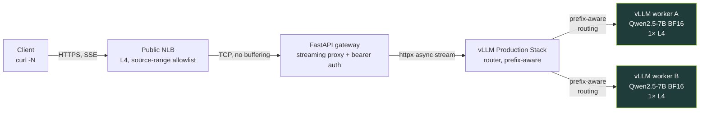
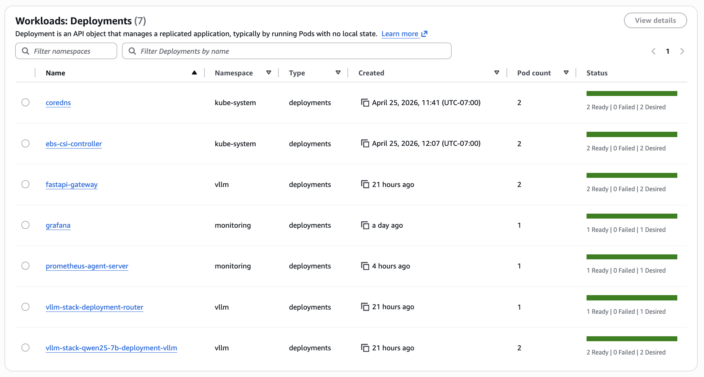
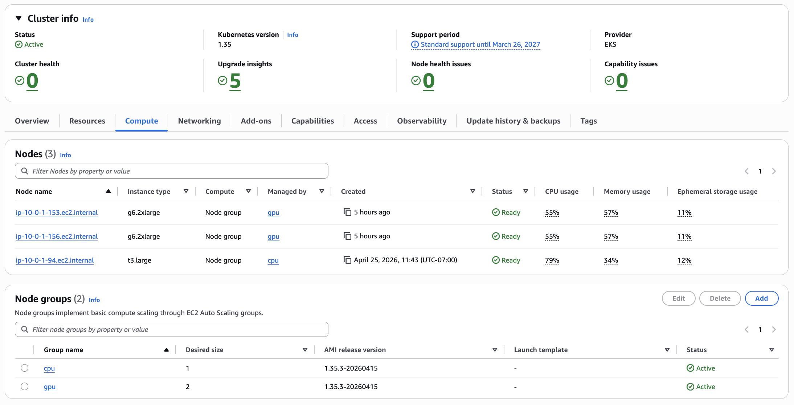
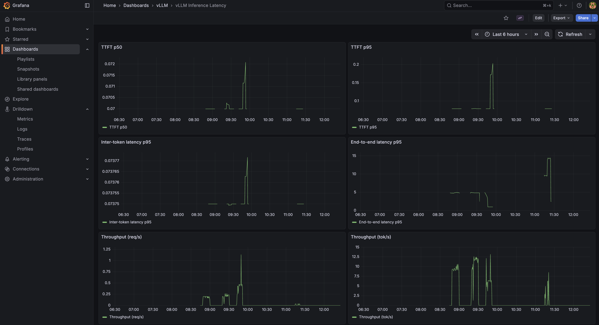
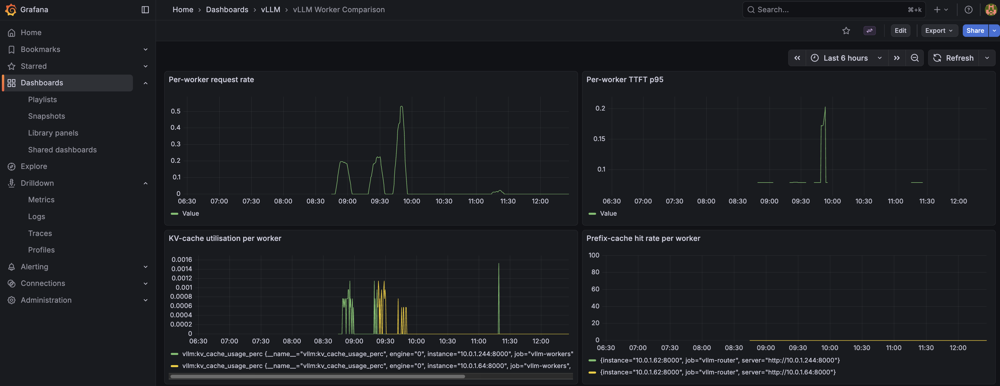
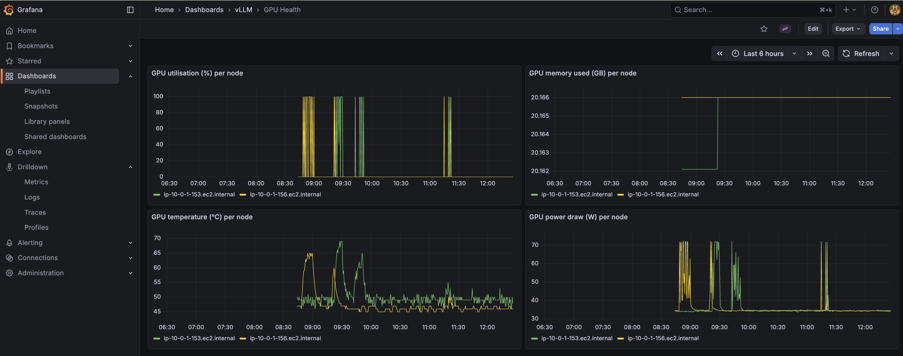

# Streaming LLM inference on EKS, end to end

## 1. The claim

Every token leaves the GPU and arrives at the client without a single intermediate layer holding it in a buffer.


This is a self-hosted LLM serving stack on EKS. Two vLLM workers serve Qwen2.5-7B in bfloat16 on g6.2xlarge nodes, one model replica per GPU. A vLLM Production Stack router sits in front and makes prefix-aware routing decisions, steering repeated prompt prefixes to the same worker so the KV cache is warm. A FastAPI gateway handles auth and proxies the token stream to the network. A public Network Load Balancer takes it from there to the client. Five components; the constraint on each was the same: do not buffer.



- **Client** — any SSE-capable HTTP client; `curl -N` is enough.
- **Public NLB (L4, source-range allowlist)** — a TCP pipe; no HTTP parsing, nothing that can re-chunk an event stream.
- **FastAPI gateway (streaming proxy + bearer auth)** — validates a bearer token, opens an `httpx` async stream to the router, re-yields each chunk into a `StreamingResponse`.
- **vLLM Production Stack router (prefix-aware)** — routes each request to the worker most likely to have the prompt's KV prefix cached.
- **vLLM workers A and B (Qwen2.5-7B BF16, 1× L4 each)** — generate tokens and stream them over the OpenAI-compatible `/v1/chat/completions` endpoint with `stream=true`.



The rest of this post is the why, layer by layer.

## 2. Why streaming is the point

The first token is what humans feel. A response that starts arriving in 200ms feels instant. The same response sitting silent for 8 seconds while the model churns through its full generation feels broken — even if the final output is identical. Time to first token (TTFT) is not a backend metric; it is the boundary between a tool that feels alive and one that feels like a batch job.

Once tokens start arriving, cadence takes over. Streaming is not just about getting the first token out fast. It is about sustaining a rhythm. A steady flow reads naturally; the eye and the brain process it in real time, following the text as if someone is typing. Irregular delivery breaks that. Tokens that arrive in bursts — a gap, then a flood — disrupt reading the same way a speaker who pauses mid-sentence does. The inter-token latency does not have to be zero, but it has to be consistent. Smoothness matters more than raw speed.

Both of these properties are fragile. Every layer in the request path has an opportunity to destroy them. Most layers buffer by default. A prefork web server holds a full response body before writing it out. A load balancer accumulating HTTP/1.1 chunks before forwarding. A streaming handler that reads the upstream body into memory before yielding. Each one adds its own delay before the first token escapes and introduces its own jitter into the cadence. The stack is only as streaming as its most-buffering layer. One wrong default anywhere and TTFT climbs; the cadence goes lumpy.

That is the constraint: no layer is allowed to buffer. It sounds simple. In practice, it touched every component selection and every configuration decision in the build. Not as a post-hoc optimization pass, but as the organizing principle from the start. Section 3 walks through what it meant at each layer.

## 3. The streaming path, layer by layer

### 3.1 vLLM workers

Each worker is a vLLM process serving Qwen2.5-7B over the OpenAI-compatible `/v1/chat/completions` endpoint. When `stream=true` arrives, vLLM emits server-sent events directly — no application-level buffering, no post-processing. The stream is born here.

The deployment runs two replicas. Each g6.2xlarge node has exactly one NVIDIA L4 GPU, and pod anti-affinity on `kubernetes.io/hostname` with `requiredDuringSchedulingIgnoredDuringExecution` makes co-location impossible — Kubernetes cannot schedule both replicas on the same node even under pressure. The result is deterministic: one worker per GPU, always.



Three `vllmConfig` settings matter:

- `enablePrefixCaching: true` — the router's `prefixaware` logic only helps if the workers actually have a KV cache the router can steer toward. These two settings have to agree; enabling one without the other is a no-op.
- `dtype: bfloat16` — the L4 has solid BF16 throughput. FP16 would also work, but BF16 is the natural fit for this GPU generation.
- `maxModelLen: 8192` — Qwen2.5-7B in BF16 uses roughly 14 GB of the L4's 24 GB VRAM. An 8192-token context window leaves around 9 GB for the KV cache, which keeps TTFT low under real load without running out of cache slots.

```yaml
vllmConfig:
  enablePrefixCaching: true
  dtype: bfloat16
  maxModelLen: 8192
  tensorParallelSize: 1
  extraArgs:
    - "--gpu-memory-utilization=0.90"
```

The image is pinned to `vllm/vllm-openai:v0.19.1`. Not `latest`. Not the chart's default `lmcache/vllm-openai`, which lags upstream by months and carries lmcache-specific patches irrelevant here. Pinning a digest would be stronger; a named tag is the practical tradeoff for a sandbox build. The point is that the chart default is wrong for this use case, and it is easy to miss.

### 3.2 The router

The vLLM Production Stack chart ships a router component that sits between the gateway and the workers. Without it, a round-robin load balancer would scatter requests across workers at random. Prefix caching on the workers would still operate, but a request whose prompt prefix is hot on worker A might land on worker B and rebuild the KV cache from cold. The cache hit becomes a cache miss. The whole point of prefix caching is to steer repeat prefixes to the worker that already has them warm.

That steering is what `routingLogic: prefixaware` does. The router tracks which prefixes each worker has cached, and routes accordingly. Paired with `enablePrefixCaching: true` on the workers (section 3.1), they form a matched pair: the workers build the cache, the router exploits it. Either setting alone is wasted effort.

The trip-up: the chart's `values.yaml` documents two routing modes — `roundrobin` and `session`. That is all. `prefixaware` appears nowhere in the chart docs. To confirm it was actually wired up, reading the router source was necessary. In `src/vllm_router/routers/routing_logic.py` in the upstream `vllm-project/production-stack` repo, the full enum is:

```python
class RoutingLogic(str, enum.Enum):
    ROUND_ROBIN = "roundrobin"
    SESSION_BASED = "session"
    KVAWARE = "kvaware"
    PREFIXAWARE = "prefixaware"
    DISAGGREGATED_PREFILL = "disaggregated_prefill"
```

_source: `src/vllm_router/routers/routing_logic.py`_

`prefixaware` is wired. The chart's docs are simply behind. Setting an undocumented value is normally a red flag; here the router accepts it at runtime, and the gap is documentation lag, not a missing implementation.

From the streaming perspective, the router is a transparent reverse proxy. It reads the request, picks a worker, and forwards the connection. The SSE response streams back through without modification. Nothing buffers; the router adds routing overhead but does not touch the response body.

### 3.3 The FastAPI gateway — the streaming proxy

The gateway is where most streaming pipes quietly break. The worker is producing tokens. The router is forwarding the stream. Then the gateway does something small — reads the upstream body into a buffer, or hands the response to a sync handler, or runs under gunicorn — and the client sees nothing until the full response is assembled. No error. No warning. Just a 10-second pause and then a wall of text.

The gateway's job is to be transparent: validate the bearer token, open a connection to the router, and re-yield bytes as they arrive. Three primitives do the actual streaming work.

`httpx.AsyncClient.send(..., stream=True)` opens the upstream connection without reading the response body. The `stream=True` flag is the critical detail — without it, httpx blocks until the full body is received before returning. With it, the connection is open and the body is unread.

`upstream.aiter_raw()` yields chunks as the upstream writes them. Raw, not decoded — the body is already SSE (`data: {...}\n\n` lines), so decoding is wasted work and a potential source of latency. Each chunk is yielded immediately as it arrives off the wire.

`StreamingResponse` wraps the async iterator. FastAPI hands each chunk to the ASGI server as it is produced. The framework does not collect them; it passes through.

These three are the entire streaming machine. Everything else in the function is plumbing around them.

```python
async def proxy_to_router(request: Request, path: str) -> StreamingResponse:
    body = await request.body()
    target = f"{ROUTER_URL}{path}"

    client = httpx.AsyncClient(timeout=REQUEST_TIMEOUT)
    upstream = await client.send(
        client.build_request("POST", target, content=body),
        stream=True,
    )

    async def iterator() -> AsyncIterator[bytes]:
        try:
            async for chunk in upstream.aiter_raw():
                yield chunk
        finally:
            await upstream.aclose()
            await client.aclose()

    return StreamingResponse(
        iterator(),
        status_code=upstream.status_code,
        headers={"Cache-Control": "no-cache", "X-Accel-Buffering": "no"},
    )
```

Two response headers are set explicitly. `Cache-Control: no-cache` tells any caching layer not to hold the response body. `X-Accel-Buffering: no` targets NGINX and NGINX-style ingress controllers, which buffer SSE responses by default — accumulating chunks until a flush threshold before forwarding. Both headers are cheap to set and cheap to skip; skipping them occasionally produces a confusing failure mode where streaming works in development and silently degrades behind an ingress.

The server is uvicorn, not gunicorn. Gunicorn is the conventional production default for Python web apps, but its prefork worker model reads complete response bodies before flushing to the OS. For SSE that means every token waits for generation to finish. Uvicorn handles ASGI directly — no worker boundary, no in-process buffer. Chunks flow as fast as the upstream produces them.

Auth runs before the proxy. `require_bearer_token` is a FastAPI dependency on the route, executed before `proxy_to_router` is called. A missing or invalid token raises `HTTP 401` immediately, before any upstream connection is opened. No half-streamed responses, no wasted GPU time for rejected requests.

Timeouts: `httpx.Timeout(connect=10.0, read=600.0, write=60.0, pool=10.0)`. The `read` timeout is long — 600 seconds — because LLM generation can be slow for long outputs. The `connect` timeout is short — 10 seconds — so a dead or restarting router surfaces as a fast error rather than a silent hang. The asymmetry is intentional.

### 3.4 NLB, not ALB

Public exposure is via an NLB, not an ALB. The distinction matters for streaming.

ALB operates at L7. It parses HTTP, applies its own chunking logic, and has buffering defaults. SSE survives an ALB — technically the events get through — but the ALB can re-chunk them, and the delivery loses cadence. The client sees bursts rather than a steady flow. No error, no flag, just lumpy output.

NLB operates at L4: TCP in, TCP out. It does not parse the response body. It cannot buffer what it does not look at. That is exactly what a streaming proxy needs at the edge.

The Kubernetes service is type `LoadBalancer` with the in-tree CCM annotation:

```hcl
annotations = {
  "service.beta.kubernetes.io/aws-load-balancer-type"                              = "nlb"
  "service.beta.kubernetes.io/aws-load-balancer-cross-zone-load-balancing-enabled" = "true"
}
```

No AWS Load Balancer Controller installed — the in-tree CCM annotation is enough. One less component to deploy, configure, and keep current in a sandbox-shaped system.

`loadBalancerSourceRanges` on the service spec allowlists the operator's IP. Not production auth; the right level of control for a sandbox NLB exposed to the internet.

The NLB is the layer most likely to silently compromise a streaming claim. Most people reach for ALB by default — it is the canonical AWS load balancer choice. For SSE specifically, it is the wrong one, and the failure is quiet enough that it is easy to miss.

### 3.5 The chain

A streaming claim is a chain claim. The weakest link wins.

The chain here has four links. vLLM workers: origin of the SSE stream, no pre-rolling, tokens emitted as they are generated. The Production Stack router: a transparent reverse proxy that picks a worker and forwards the connection without touching the response body. The FastAPI gateway: `httpx` async stream, `aiter_raw`, `StreamingResponse`, uvicorn instead of gunicorn, `Cache-Control` and `X-Accel-Buffering` headers set explicitly. The NLB: L4, TCP in and TCP out, cannot buffer what it does not parse.

None of these was the default behavior of its layer. vLLM's default image is wrong for this use case. The router's prefix-aware mode is undocumented. The gateway requires three specific primitives and the right server. The NLB requires overriding the conventional ALB choice.

If any single one of these went the default way, the headline claim would be a lie.

## 4. Proving it — what the dashboards show

The metrics path is: vLLM workers expose Prometheus metrics; an in-cluster prometheus-agent scrapes them and remote-writes to AMP; Grafana queries AMP through a sigv4 datasource pinned to uid `amp`. The dashboards are version-controlled JSON in `infra/platform-apps/dashboards/`, baked into ConfigMaps, and loaded by Grafana on startup via a provisioning sidecar. There is no manual import step, no dashboard state that lives outside the repo.

Two dashboards cover the stack.

**`inference-latency.json`** — six panels: TTFT p50, TTFT p95, Inter-token latency p95, End-to-end latency p95, Throughput (req/s), Throughput (tok/s). This dashboard is the direct proof of the streaming claim. Section 2 named TTFT and inter-token latency as the two properties humans actually perceive in a streaming response. Those are exactly the metrics in the top half of this dashboard. If TTFT p95 is low and inter-token latency p95 is stable, the chain is doing its job. If either climbs, something in the path is buffering or stalling, and the dashboard surfaces it immediately.



Under the sandbox load shown above, TTFT p50 sits at ~70 ms and p95 around ~150 ms — comfortably under the 200 ms threshold that makes a response feel instant. The inter-token and throughput panels reflect single-stream traffic and are not a stress benchmark; a controlled-concurrency benchmark is the subject of the follow-up post.

**`worker-comparison.json`** — five panels, all per-worker: Per-worker request rate, Per-worker TTFT p95, KV-cache utilisation per worker, Prefix-cache hit rate per worker, Queue depth per worker. This dashboard confirms that both workers are actually receiving traffic, and that the KV and prefix caches are live and being measured. Demonstrating that prefix-aware routing is doing useful work — repeated-prefix workloads showing one worker cache-hot and the other cold — requires a dedicated load pattern and is the subject of a follow-up post. This dashboard establishes that the data is wired up correctly.



A third dashboard, `gpu-health.json`, surfaces per-node GPU utilisation, memory, temperature, and power draw via the DCGM exporter. GPU internals are not the focus of this post — this is included as evidence that GPU telemetry is wired into the same pipeline.



The 307 redirect. The gateway originally exposed its own Prometheus metrics by mounting `prometheus_client.make_asgi_app()` at `/metrics`. Starlette responded to `GET /metrics` with a 307 redirect to `/metrics/`. The scraper did not follow it. Every gateway metric was dropped silently — no error, no alert, no log line. The Grafana panels for the gateway simply showed no data. The fix in commit `519a60e` replaced the mount with a plain `@app.get("/metrics")` handler that calls `generate_latest()` directly and returns a `Response` with the correct content type. One redirect, zero data, a blank dashboard. The kind of failure that looks like a provisioning problem until it does not.

## 5. The supporting cast

Sections 1–4 cover the streaming spine. The decisions below sit adjacent to it — none of them appear in the token path, but each one reflects a concrete choice over a less-considered default.

### Pod Identity over IRSA

Two components need AWS credentials in-cluster: Grafana to query AMP, and prometheus-agent to remote-write to it. Both use EKS Pod Identity associations (`aws_eks_pod_identity_association.grafana` in `infra/platform-apps/grafana-iam.tf`, `aws_eks_pod_identity_association.prometheus_agent` in `prometheus-agent-iam.tf`) rather than IRSA.

The practical difference: with IRSA, every IAM role's trust policy embeds the cluster's OIDC provider ARN. The role definition becomes cluster-specific. Rebuild or rename the cluster and the trust policies need updating across every role. With Pod Identity, the trust policy principal is `pods.eks.amazonaws.com` — no cluster ARN, no OIDC URL. The same role works on any EKS cluster without touching IAM. Pod Identity is the newer pattern (GA'd 2023) and the cleaner choice for any greenfield EKS work. IRSA remains common because most documentation still defaults to it; it is not the better option.

### Managed observability — AMP, prometheus-agent, stateless Grafana

The metrics pipeline runs three managed or near-stateless pieces. AMP (Amazon Managed Prometheus) stores the metrics — no Prometheus server to run, scale, back up, or migrate. An in-cluster `prometheus-agent` Helm release scrapes the vLLM workers and remote-writes to AMP; the agent mode means no local storage, no compaction, no retention to reason about. Grafana runs in-cluster but owns no state: dashboards are version-controlled JSON in `infra/platform-apps/dashboards/`, baked into ConfigMaps, and loaded at startup through a provisioning sidecar. No persistent volume. No in-cluster Prometheus. If the Grafana pod dies, the replacement comes up identical — there is no state to recover.

The stack originally used AMP's managed agentless scraper. Its startup and reload times were long enough to make every scrape-config tweak slow, which is a tax that compounds quickly when iterating on a demo like this. The self-hosted prometheus-agent restored a fast inner loop with the same managed storage layer underneath. Every piece of persistent state that could be pushed out of the cluster was.

### Two-phase Terraform deploy with content-hash image tags

The gateway Helm release references an ECR image, which means ECR must exist before the image can be pushed and before the release can be applied. A single-phase `terraform apply` hits a dependency cycle: the image push needs the repo URL, the Helm release needs the image tag, and none of it can resolve until ECR is up. The fix is two phases inside `infra/platform-apps`: `terraform apply -target=aws_ecr_repository.fastapi` creates the repo first, then a full `terraform apply` builds the image and brings up everything else.

The image tag is a 12-character SHA-256 prefix computed in `gateway.tf` from `filesha256` across every file the Dockerfile copies in — `Dockerfile`, `pyproject.toml`, `uv.lock`, and `app/**`. The tag is deterministic from source content. Change a source file and the tag changes; Terraform rebuilds and repushes. Change nothing and the tag is identical; Terraform no-ops the provisioner. No `latest` tag, no manual version bumps, no rebuild-on-every-apply.

### Scale-to-zero in one Terraform variable

One variable — `gpu_desired_size` in `infra/eks-foundation/variables.tf`, range 0–2 — controls GPU node capacity in the managed node group. `terraform apply -var gpu_desired_size=0` drains the GPU nodes. Everything else stays up: control plane, networking stack, AMP workspace, ECR images, Grafana dashboards, observability pipeline. `terraform apply -var gpu_desired_size=2` brings them back; add node-ready time and model load and the stack is serving in roughly five minutes.

This is a sandbox. GPU instances are the dominant cost. With `gpu_desired_size=0`, the running cost drops to approximately $170/month — cluster control plane, the NLB, and the lightweight supporting nodes. The GPU spend is zero. Parking the cluster between work sessions is one variable change, not a teardown-and-rebuild cycle.

## 6. Wrap

The full stack is in `https://github.com/Nicolas-Richard/vllm-on-eks`. `make deploy` brings it up: a targeted `terraform apply` for ECR first to break the image-push dependency cycle, then a full apply for everything else. The repo includes the Grafana dashboards, the gateway source, and the Helm values; any AWS account in an EKS-eligible region with a g6.2xlarge quota can reproduce the full stack from scratch. Scale-to-zero via `gpu_desired_size=0` keeps the idle cost manageable between sessions.

The follow-up post will cover benchmarking and a prefix-aware-routing demonstration on this same stack.

The component decisions documented here — vLLM image pin, router routing logic, `httpx` async stream with `aiter_raw`, uvicorn over gunicorn, NLB over ALB — were each the non-default choice for the same reason: the default would have buffered the stream somewhere in the path.
